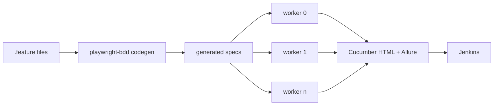

<div align="center">


</div>

## Baran Doğanbaş

QA Automation Engineer at BeamSec, Ankara.

```gherkin
Feature: Baran DOGANBAS

  Background:
    Given testing enterprise software since 2023
    And an ISTQB Foundation certification

  Scenario: On a given week
    * reports 390+ defects and verifies 330+ fixes
    * builds Playwright and BDD frameworks from an empty repo
    * load-tests to 30,000 virtual users and reports where it gives out
    * evaluates LLM agents and agentic workflows
    * tests LDAP, Active Directory and Azure AD integrations
    * refuses to close a ticket on "works on my machine"
```

### Stack

- **Automation** — Playwright, playwright-bdd, TypeScript, Selenium, Cucumber, Page Object Model
- **API & backend** — Rest Assured, Postman, Swagger, Spring Boot debugging, RabbitMQ, Docker
- **Performance** — JMeter, Gatling, staged ramp strategies, custom HTML report templates
- **Identity & infra** — LDAP, Active Directory, Azure AD, GPO, Jenkins, CI/CD
- **Data** — PostgreSQL, MongoDB, MySQL
- **AI evaluation** — LLM output validation, prompt regression, conversation-log analysis, failure taxonomies

### Public work

[](https://github.com/BaranDoganbas/playwright-bdd-demo/actions)

**[playwright-bdd-demo](https://github.com/BaranDoganbas/playwright-bdd-demo)** — the framework I
run at work, stripped of anything proprietary and pointed at a public demo app. CI rebuilds and
republishes the Cucumber report on every push, so what you open is whatever the last commit
actually produced. <!-- suite:start --> **7/7 scenarios passing** as of 07 Aug 2026. <!-- suite:end -->
[Live report →](https://barandoganbas.github.io/playwright-bdd-demo/)

### How the suite is put together



<details>
<summary>Decisions in there I would actually argue about</summary>

<br>

**Test data is derived from `workerIndex`, not a shared fixture.** Parallel runs that share a
seed user look fine until two workers hit the same record and one of them fails for reasons that
have nothing to do with the feature under test. Deriving the data per worker costs a few lines
and removes a whole category of flake.

**Serial is a tag, not a default.** A handful of flows genuinely cannot run in parallel, usually
because they mutate tenant-level state. Those get `@mode:serial`. Everything else runs wide.
Marking the whole suite serial because three specs misbehave is how a suite ends up taking
forty minutes.

**Auth runs once and gets reused.** Storage state, set up in a project dependency. Logging in
before every scenario is the single most common reason a small suite feels slow.

**Two reporters, not four.** Cucumber HTML for people who want to read scenarios, Allure for
history and trends. I tried Monocart alongside them and removed it; a third view of the same
run is maintenance, not information.

</details>

### Elsewhere

[Portfolio](https://barandoganbas.netlify.app/) ·
[LinkedIn](https://www.linkedin.com/in/barandoganbas/) ·
[Medium](https://medium.com/@barandoganbas) ·
barandoganbas@gmail.com

<sub>[](https://github.com/BaranDoganbas/BaranDoganbas/actions/workflows/links.yml) Every link here is checked weekly. Filing bugs for a living and shipping a dead link would be embarrassing.</sub>
