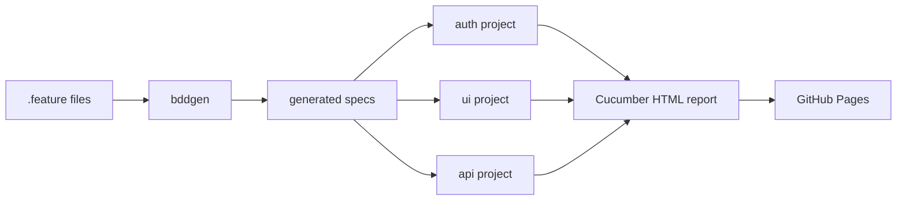

<div align="center">


</div>

## Baran Doğanbaş

QA Automation Engineer at BeamSec, Ankara.

```gherkin
Feature: Baran Doganbas

  Background:
    Given testing enterprise software since 2022
    And an ISTQB Foundation certification

  Scenario: On a given week
    * reports 390+ defects and verifies 330+ fixes
    * builds Playwright and BDD frameworks from an empty repo
    * load-tests to 30,000 virtual users and reports where it gives out
    * evaluates LLM agents and agentic workflows
    * tests LDAP, Active Directory and Azure AD integrations
    * refuses to close a ticket on "works on my machine"
```

### Stack

- **Automation** — Playwright, playwright-bdd, TypeScript, Selenium, Cucumber, Page Object Model
- **API & backend** — Rest Assured, Postman, Swagger, Spring Boot debugging, RabbitMQ, Docker
- **Performance** — JMeter, Gatling, staged ramp strategies, custom HTML report templates
- **Identity & infra** — LDAP, Active Directory, Azure AD, GPO, Jenkins, CI/CD
- **Data** — PostgreSQL, MongoDB, MySQL
- **AI evaluation** — LLM output validation, prompt regression, conversation-log analysis, failure taxonomies

### Public work

[](https://github.com/BaranDoganbas/playwright-bdd-demo/actions)

**[playwright-bdd-demo](https://github.com/BaranDoganbas/playwright-bdd-demo)** — the framework I
run at work, stripped of anything proprietary and pointed at a public demo app. CI rebuilds and
republishes the Cucumber report on every push, so what you open is whatever the last commit
actually produced. <!-- suite:start --> **26/26 scenarios passing** as of 07 Aug 2026. <!-- suite:end -->
[Live report →](https://barandoganbas.github.io/playwright-bdd-demo/)

### How the suite is put together



<details>
<summary>Decisions in there I would actually argue about</summary>

<br>

**Step definitions are scoped per project, not globally.** The UI project cannot resolve an API
step and vice versa. Share one global step pool and a genuinely missing definition hides behind an
accidental match from the other suite, which is a failure that looks like a pass.

**Login runs once.** A `setup` project signs in and persists storage state, and the UI project
depends on it. The auth scenarios deliberately opt out, because signing in is the thing they test.
Authentication is the most common reason a small suite feels slow and the most common source of
flake nobody attributes correctly.

**`forbidOnly` is on in CI.** A stray `.only` that reaches main should turn the run red, not
quietly reduce the suite to one spec and report green.

**The checkout total is computed from the page, not hardcoded.** An assertion against a literal
number passes for the wrong reason the moment the tax rate changes. Reading the value and checking
the arithmetic tests the behaviour instead of the fixture.

</details>

### Elsewhere

[Portfolio](https://barandoganbas.netlify.app/) ·
[LinkedIn](https://www.linkedin.com/in/barandoganbas/) ·
[Medium](https://medium.com/@barandoganbas) ·
barandoganbas@gmail.com

<sub>[](https://github.com/BaranDoganbas/BaranDoganbas/actions/workflows/links.yml) Every link here is checked weekly. Filing bugs for a living and shipping a dead link would be embarrassing.</sub>
