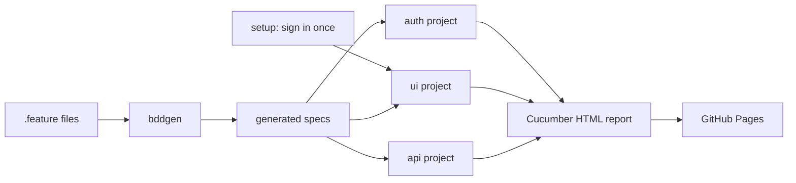

<div align="center">


</div>

## Baran Doğanbaş

QA Engineer at BeamSec, Ankara. Test automation and requirements analysis.

```gherkin
Feature: Baran Doganbas

  Background:
    Given testing software and systems since 2023
    And an ISTQB Foundation certification

  Scenario: At BeamSec, since February 2025
    * has reported 410+ defects and verified 370+ fixes
    * automates tenant-isolation and role-permission checks in Playwright
    * load-tests to 30,000 virtual users and reports where it gives out
    * evaluates LLM agents for hallucination risk and multi-step reliability
    * tests LDAP, Active Directory and Azure AD integrations
    * turns product documents into acceptance criteria before code is written
    * refuses to close a ticket on "works on my machine"
```

### Stack

- **Automation:** Playwright, playwright-bdd, TypeScript, Page Object Model. Earlier: Selenium, Cucumber (Java)
- **API & backend:** Postman, Swagger, Spring Boot debugging, RabbitMQ, Docker. Earlier: Rest Assured
- **Performance:** JMeter, Gatling, staged ramp strategies, custom HTML report templates
- **Identity & infra:** LDAP, Active Directory, Azure AD, GPO, GitHub Actions. Earlier: Jenkins
- **Data:** PostgreSQL, MongoDB. Earlier: MySQL
- **AI evaluation:** hallucination risk analysis, LLM output validation, conversation-log analysis, failure taxonomies

### Public work

[](https://github.com/BaranDoganbas/playwright-bdd-demo/actions)

**[playwright-bdd-demo](https://github.com/BaranDoganbas/playwright-bdd-demo)** is a public suite
built on the patterns I use at work, pointed at two demo targets: SauceDemo for the UI and RESTful
Booker for the API. The targets are simple on purpose; what matters is how the suite is built. CI
rebuilds and republishes the Cucumber report on every push, so what you open is whatever the last
commit actually produced: 26 scenarios, 11 of them negative paths, across four Playwright projects.
[Live report →](https://barandoganbas.github.io/playwright-bdd-demo/)

### How the suite is put together


```mermaid
flowchart LR
    F[".feature files"] --> G[bddgen]
    G --> S[generated specs]
    L[setup: sign in once] --> U
    S --> A[auth project]
    S --> U[ui project]
    S --> P[api project]
    A & U & P --> R[Cucumber HTML report]
    R --> GP[GitHub Pages]
```

<details>
<summary>Decisions in there I would actually argue about</summary>

<br>

**Authorization is checked where it is enforced.** After a write without a token comes back 403,
the test reads the booking again and checks that nothing changed. A 403 on its own only proves the
API said no, not that it did nothing.

**Step definitions are scoped per project, not globally.** The UI project cannot resolve an API
step and vice versa. Share one global step pool and a genuinely missing definition hides behind an
accidental match from the other suite, which is a failure that looks like a pass.

**Login runs once.** A `setup` project signs in and persists storage state, and the UI project
depends on it. The auth scenarios deliberately opt out, because signing in is the thing they test.
Authentication is the most common reason a small suite feels slow and the most common source of
flake nobody attributes correctly.

**`forbidOnly` is on in CI.** A stray `.only` that reaches main should turn the run red, not
quietly reduce the suite to one spec and report green.

**The checkout total is computed from the page, not hardcoded.** An assertion against a literal
number passes for the wrong reason the moment the tax rate changes. Reading the value and checking
the arithmetic tests the behavior instead of the fixture.

</details>

### Elsewhere

[Portfolio](https://barandoganbas.netlify.app/) ·
[LinkedIn](https://www.linkedin.com/in/barandoganbas/) ·
[Medium](https://medium.com/@barandoganbas) ·
barandoganbas@gmail.com

<sub>[](https://github.com/BaranDoganbas/BaranDoganbas/actions/workflows/links.yml) Every link here is checked weekly. Filing bugs for a living and shipping a dead link would be embarrassing.</sub>
